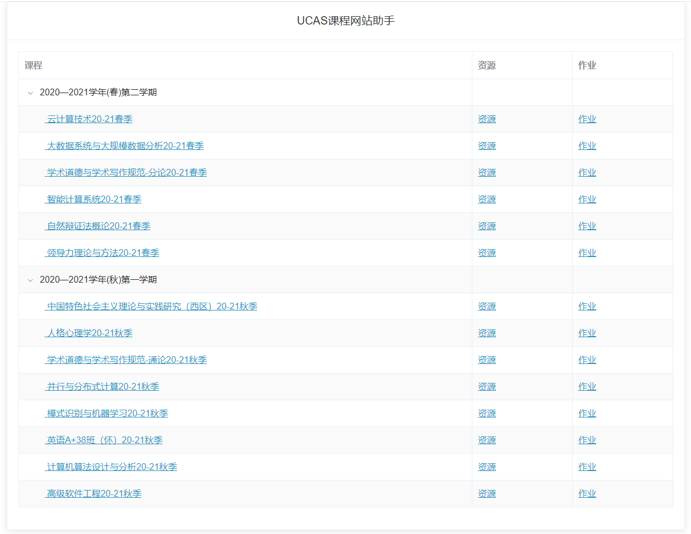

# UCASCourseSiteHelper
基于tampermonkey编写的UCAS课程网站助手，屏蔽课程网站冗余的信息，聚合UCAS课程网站的资源和作业页面、资源页面自动按最近修改时间降序排列、自动切换到第二身份。

## 如何使用

1. 安装chrome插件[tampermonkey](https://www.tampermonkey.net/)

2. 安装本脚本

3. 进入课程网站

## 效果图

